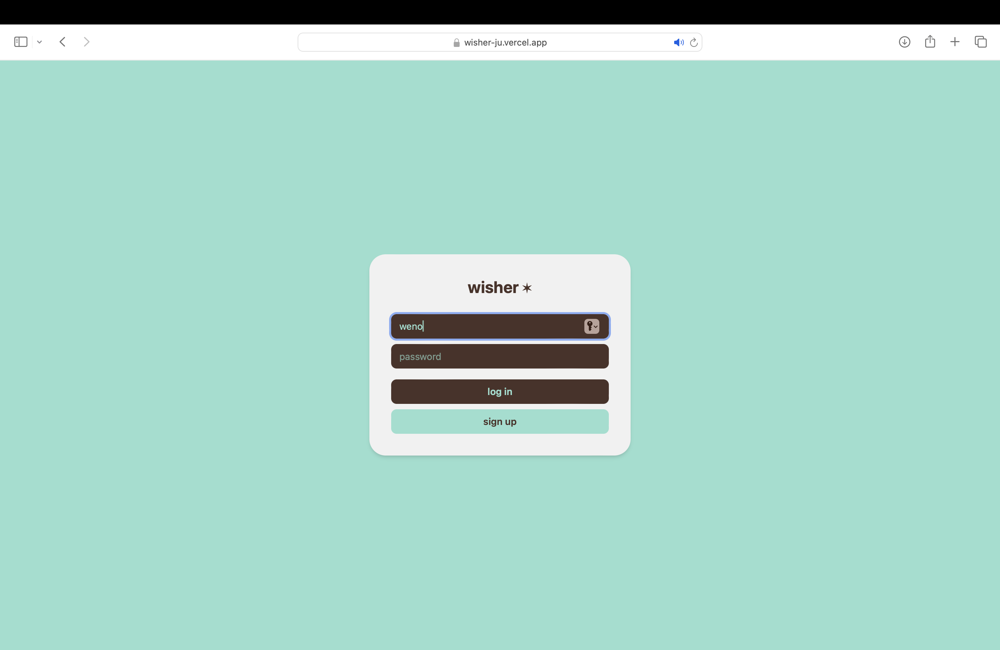
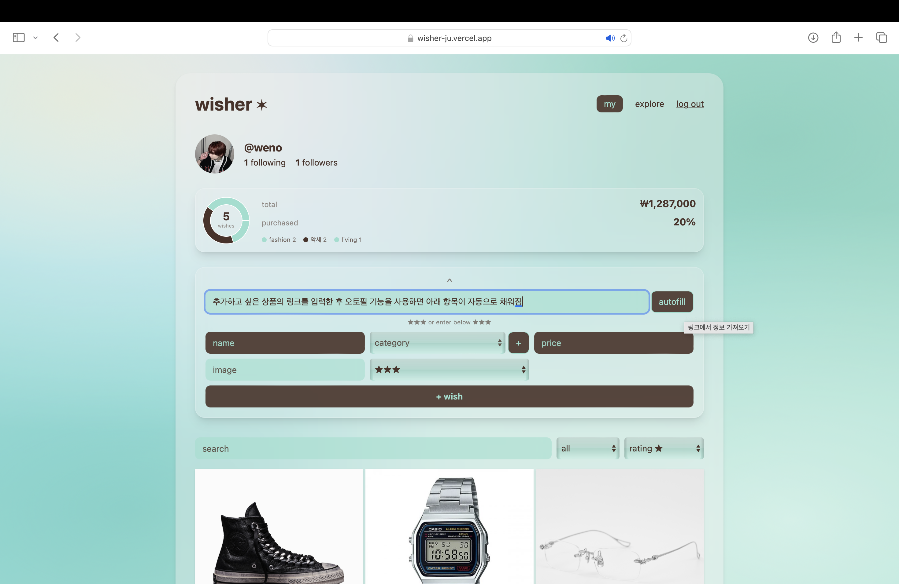
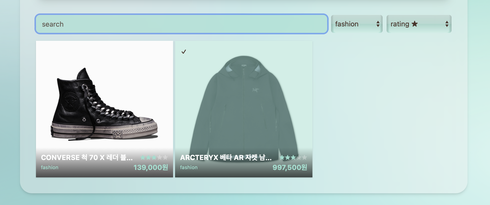
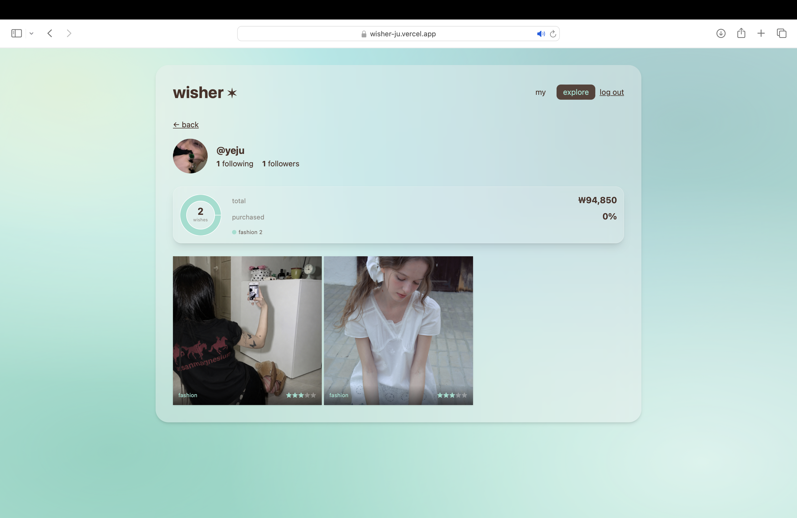

# wisher ✶

> 갖고 싶은 것을 등록·분류·관리하고, 다른 사람과 위시리스트를 공유·팔로우하는 **소셜 위시리스트 서비스**

로그인부터 위시 관리, 통계 대시보드, 팔로우까지 갖춘 풀스택 웹 애플리케이션입니다. 백엔드(Spring Boot)와 프론트엔드(React)를 직접 구현하고 클라우드에 배포했습니다.

## 🔗 배포 링크

| 구분 | 링크 |
| :---- | :---- |
| **서비스 (Live Demo)** | [https://wisher-ju.vercel.app](https://wisher.vercel.app\)」) |
| 백엔드 API | [https://wishlist-production-d218.up.railway.app](https://wishlist-production-d218.up.railway.app) |
| 프론트엔드 저장소 | [https://github.com/yejooi/wishlist-front](https://github.com/yejooi/wishlist-front) |
| 백엔드 저장소 | [https://github.com/yejooi/wishlist](https://github.com/yejooi/wishlist) |

> 게스트 체험용 계정: `weno` / `weno`

## 📸 스크린샷

## ✨ 주요 기능

- **회원가입 / 로그인** — JWT 기반 인증, BCrypt 비밀번호 암호화  
- **위시 아이템 관리 (CRUD)** — 이름·카테고리·가격·링크·이미지·별점 등록/수정/삭제  
- **링크 자동 채우기** — 상품 URL을 넣으면 Open Graph 메타태그를 파싱해 이름·이미지·가격 자동 입력  
- **상태 관리** — 위시중 ↔ 구매완료 토글, 구매 완료 시 목록 하단으로 정렬  
- **커스텀 카테고리** — 사용자가 직접 카테고리 추가  
- **검색 · 필터 · 정렬** — 이름 검색, 카테고리 필터, 가격·별점 정렬  
- **통계 대시보드** — 총 지출 예상액, 구매 달성률, 카테고리 분포를 도넛 차트로 시각화  
- **소셜 기능** — 다른 사용자 탐색, 팔로우/언팔로우, 팔로잉·팔로워 수, 남의 위시리스트 구경  
- **프로필** — 프로필 사진 변경  
- **반응형 UI** — 모바일·데스크탑 대응

## 🛠 기술 스택

**Backend**

- Java 21, Spring Boot 3.5.16  
- Spring Web (REST API)  
- Spring Data JPA / Hibernate  
- Spring Security 6 \+ JWT (jjwt 0.12.6)  
- MySQL  
- Jsoup (HTML/Open Graph 파싱)  
- Gradle

**Frontend**

- React (Vite)  
- Tailwind CSS v4  
- axios  
- Recharts (차트)

**Infra / Deploy**

- Backend: Railway (+ MySQL)  
- Frontend: Vercel  
- CI/CD: GitHub 연동 자동 배포

## 🗂 시스템 구성

\[ 사용자 브라우저 \]

        │

        ▼

\[ Frontend · React (Vercel) \]

        │  REST API (axios) \+ JWT

        ▼

\[ Backend · Spring Boot (Railway) \]

        │  Spring Data JPA

        ▼

\[ MySQL (Railway) \]

- 프론트엔드는 로그인 시 발급받은 **JWT를 localStorage에 저장**하고, 모든 요청 헤더(`Authorization: Bearer`)에 자동으로 실어 보냅니다.  
- 백엔드는 요청마다 JWT를 검증(`OncePerRequestFilter`)해 인증된 사용자만 자신의 데이터에 접근하도록 합니다.

## 📋 주요 API

| Method | Endpoint | 설명 | 인증 |
| :---- | :---- | :---- | :---: |
| POST | `/auth/signup` | 회원가입 |  |
| POST | `/auth/login` | 로그인 (JWT 발급) |  |
| GET | `/wishes` | 내 위시 목록 조회 | ✅ |
| POST | `/wishes` | 위시 등록 | ✅ |
| PUT | `/wishes/{id}` | 위시 수정 | ✅ |
| DELETE | `/wishes/{id}` | 위시 삭제 | ✅ |
| PUT | `/wishes/{id}/toggle` | 구매 상태 전환 | ✅ |
| GET | `/wishes/preview?url=` | 링크 메타태그 파싱(자동 채우기) | ✅ |
| GET | `/wishes/user/{username}` | 특정 사용자의 위시 조회 | ✅ |
| GET | `/users` | 사용자 목록 \+ 팔로우 여부 | ✅ |
| POST/DELETE | `/users/{username}/follow` | 팔로우 / 언팔로우 | ✅ |
| GET | `/users/{username}/profile` | 프로필 조회 | ✅ |
| PUT | `/users/me/profile-image` | 프로필 사진 변경 | ✅ |

## 🗃 데이터 모델

- **User** — id, username(unique), password(BCrypt), profileImg  
- **WishItem** — id, name, category, price, link, imgUrl, status(위시중/구매완료), rating, owner(→User)  
- **Follow** — id, follower(→User), following(→User) · (follower, following) 복합 유니크

## 💡 구현하며 고민한 점 (Troubleshooting)

**1\. JWT 기반 무상태(Stateless) 인증** 세션 대신 JWT를 도입해 서버가 로그인 상태를 저장하지 않도록 설계했습니다. `OncePerRequestFilter`로 요청마다 토큰을 검증하고, `SecurityContext`에 인증 정보를 등록해 사용자별 데이터 접근을 제어했습니다.

**2\. 배포 환경의 CORS 문제 해결** 로컬에서는 되던 로그인이 배포 후 CORS preflight(OPTIONS)에서 막혔습니다. Vercel이 배포마다 여러 도메인을 생성한다는 점을 파악하고, `setAllowedOriginPatterns`로 `*.vercel.app`을 허용해 도메인이 바뀌어도 동작하도록 처리했습니다.

**3\. 개발/운영 환경 분리** DB 접속 정보와 JWT 시크릿, API 주소를 코드에 하드코딩하지 않고 **환경변수(`${VAR:default}`, Vite `import.meta.env`)로 분리**했습니다. 로컬은 로컬 MySQL, 운영은 Railway MySQL을 바라보도록 구성해 배포 시 코드 수정 없이 접속 정보만 전환됩니다.

**4\. 외부 링크 메타데이터 파싱** Jsoup으로 상품 페이지의 Open Graph 태그(`og:title`, `og:image` 등)를 파싱해, 사용자가 URL만 붙여넣으면 상품 정보가 자동으로 채워지도록 구현했습니다.

**5\. 반응형 레이아웃** Tailwind의 모바일 우선(mobile-first) 방식으로, 화면 폭에 따라 그리드 열 수와 요소 색상 배치가 달라지도록 대응했습니다.

## 🚀 로컬 실행 방법

**백엔드**

git clone https://github.com/yejooi/wishlist.git

cd wishlist

./gradlew bootRun

\# 기본 http://localhost:8080

**프론트엔드**

git clone https://github.com/yejooi/wishlist-front.git

cd wishlist-front

npm install

npm run dev

\# 기본 http://localhost:5173

## 👤 개발자

예주 — 백엔드 중심 풀스택 개발 (기획 · 백엔드 · 프론트엔드 · 배포 전 과정 1인 구현)